# Data Flow Architecture

## Overview

The Supply Chain Finance Platform handles complex data flows across multiple domains, services, and external systems. This document describes the key data flows, processing patterns, and storage mechanisms used throughout the platform.

## Core Data Flow Patterns

### 1. User Interaction Flow
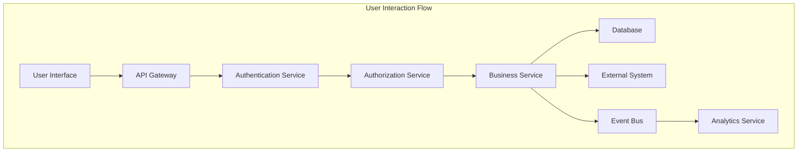

### 2. Real-time Data Processing Flow
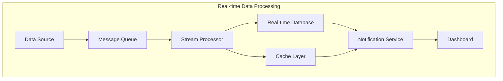

### 3. Batch Processing Flow
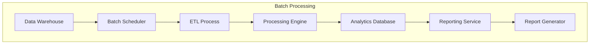

## Domain-Specific Data Flows

### Supply Chain Data Flow
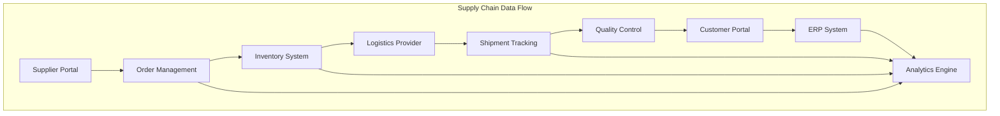

### Financial Data Flow
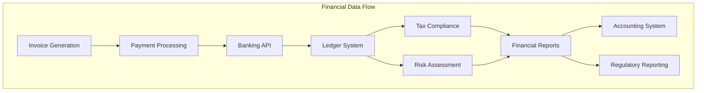

### Blockchain Data Flow
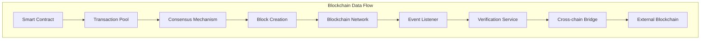

### AI/ML Data Flow
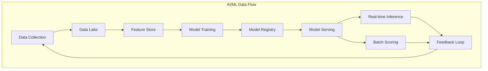

### IoT Data Flow
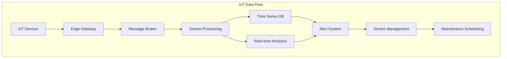

## Cross-Domain Data Integration

### Unified Data Platform
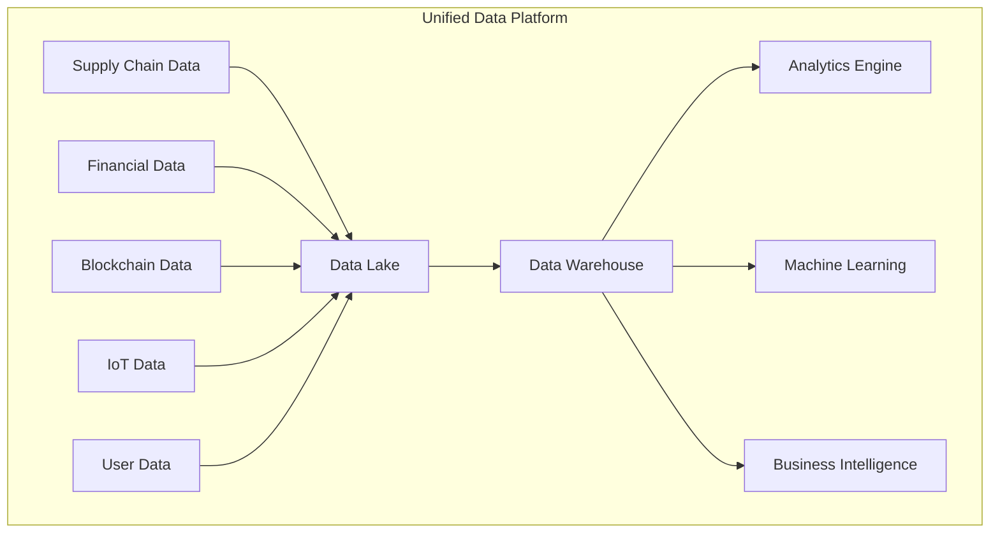

## Data Processing Layers

### 1. Ingestion Layer
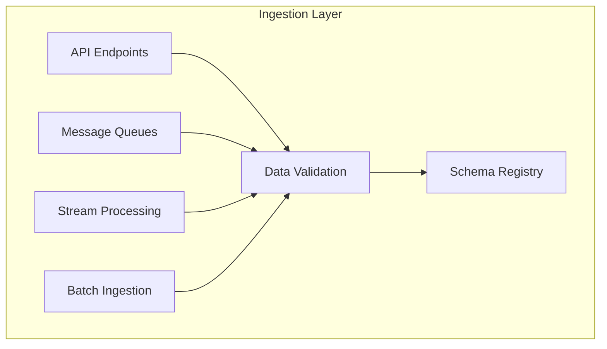

### 2. Processing Layer
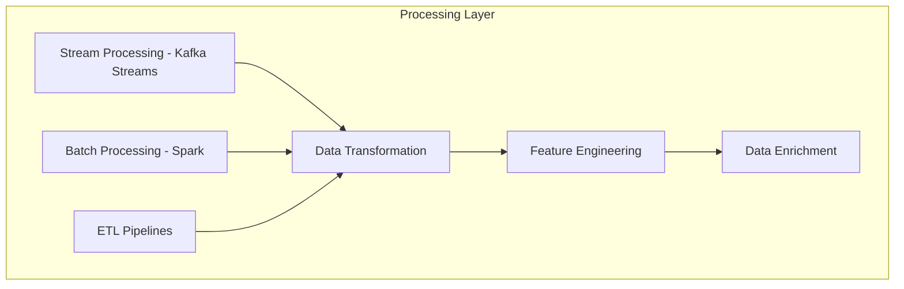

### 3. Storage Layer
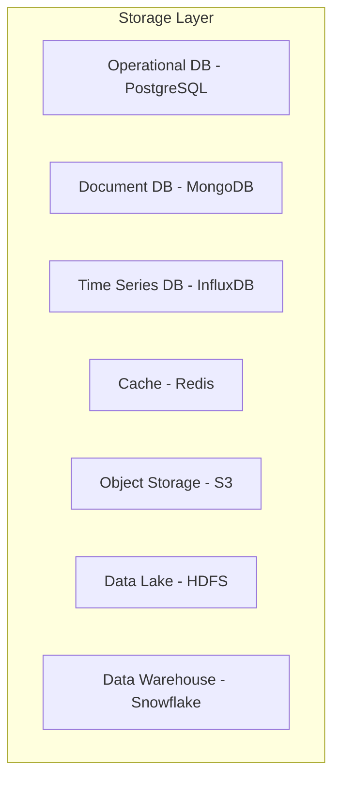

### 4. Consumption Layer
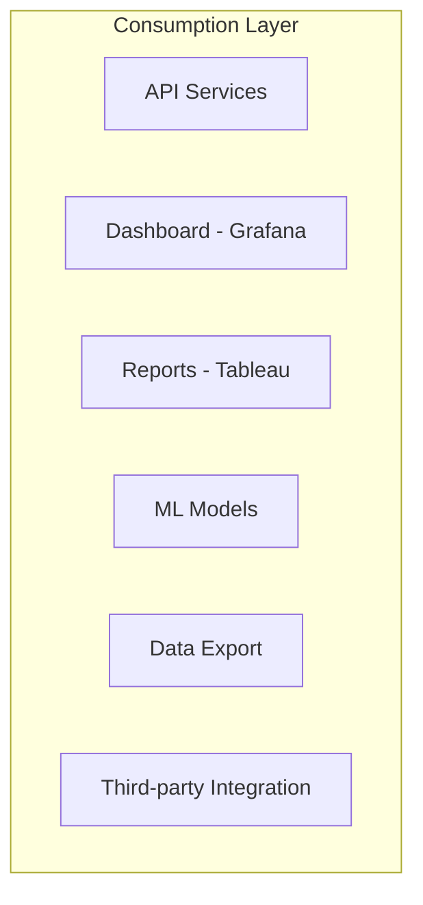

## Data Security and Compliance

### Data Encryption Flow
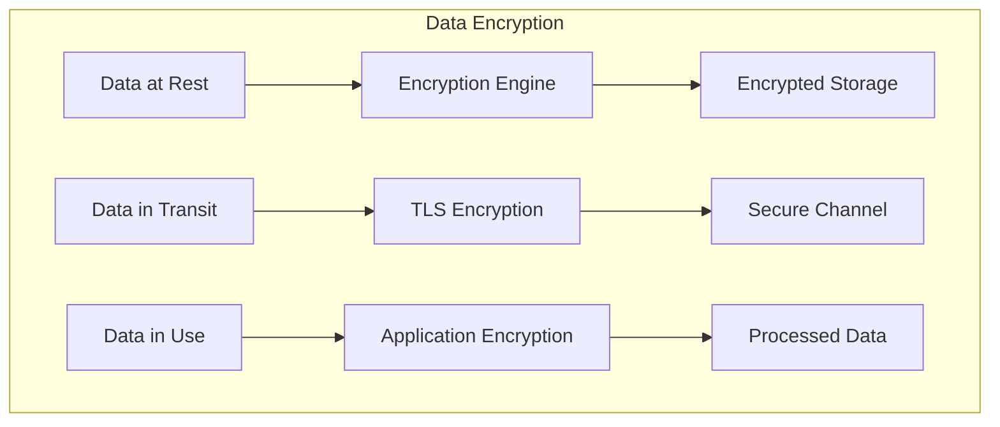

### Data Privacy Flow
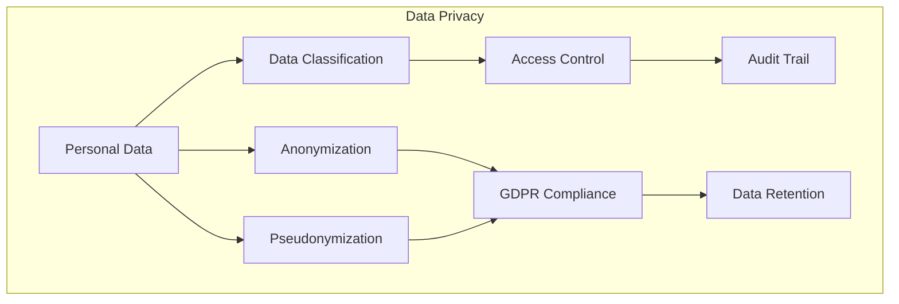

## Data Governance

### Data Quality Pipeline
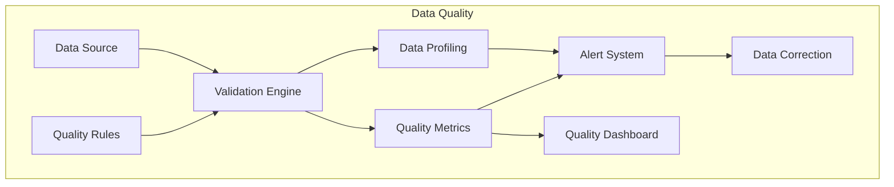

### Metadata Management
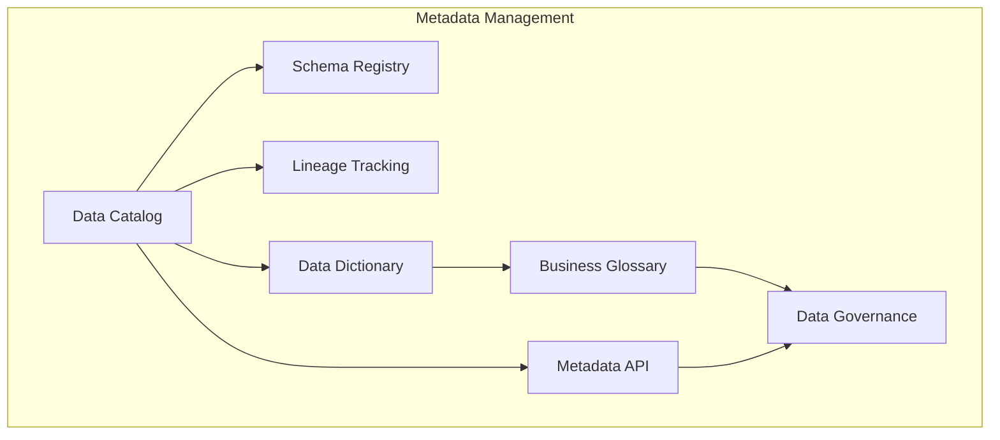

This data flow architecture shows how data moves through the Supply Chain Finance Platform, from ingestion to processing to storage and finally to consumption by various services and users. The architecture supports both real-time and batch processing patterns with appropriate security and governance measures.# Data Flow Architecture

## Overview

The Supply Chain Finance Platform handles complex data flows across multiple domains, services, and external systems. This document describes the key data flows, processing patterns, and storage mechanisms used throughout the platform.

## Core Data Flow Patterns

### 1. User Interaction Flow


### 2. Real-time Data Processing Flow


### 3. Batch Processing Flow


## Domain-Specific Data Flows

### Supply Chain Data Flow
```mermaid
graph TB
    subgraph "Supply Chain Data Flow"
        A[Supplier Portal]
        B[Order Management]
        C[Inventory System]
        D[Logistics Provider]
        E[Shipment Tracking]
        F[Quality Control]
        G[Customer Portal]
        H[ERP System]
        I[Analytics Engine]
    end

    A --> B
    B --> C
    C --> D
    D --> E
    E --> F
    F --> G
    G --> H
    H --> I
    B --> I
    C --> I
    E --> I
```

### Financial Data Flow
```mermaid
graph TB
    subgraph "Financial Data Flow"
        A[Invoice Generation]
        B[Payment Processing]
        C[Banking API]
        D[Ledger System]
        E[Tax Compliance]
        F[Risk Assessment]
        G[Financial Reports]
        H[Accounting System]
        I[Regulatory Reporting]
    end

    A --> B
    B --> C
    C --> D
    D --> E
    D --> F
    E --> G
    F --> G
    G --> H
    G --> I
```

### Blockchain Data Flow
```mermaid
graph TB
    subgraph "Blockchain Data Flow"
        A[Smart Contract]
        B[Transaction Pool]
        C[Consensus Mechanism]
        D[Block Creation]
        E[Blockchain Network]
        F[Event Listener]
        G[Verification Service]
        H[Cross-chain Bridge]
        I[External Blockchain]
    end

    A --> B
    B --> C
    C --> D
    D --> E
    E --> F
    F --> G
    G --> H
    H --> I
```

### AI/ML Data Flow
```mermaid
graph TB
    subgraph "AI/ML Data Flow"
        A[Data Collection]
        B[Data Lake]
        C[Feature Store]
        D[Model Training]
        E[Model Registry]
        F[Model Serving]
        G[Real-time Inference]
        H[Batch Scoring]
        I[Feedback Loop]
    end

    A --> B
    B --> C
    C --> D
    D --> E
    E --> F
    F --> G
    F --> H
    G --> I
    H --> I
    I --> A
```

### IoT Data Flow
```mermaid
graph TB
    subgraph "IoT Data Flow"
        A[IoT Devices]
        B[Edge Gateway]
        C[Message Broker]
        D[Stream Processing]
        E[Time Series DB]
        F[Real-time Analytics]
        G[Alert System]
        H[Device Management]
        I[Maintenance Scheduling]
    end

    A --> B
    B --> C
    C --> D
    D --> E
    D --> F
    E --> G
    F --> G
    G --> H
    H --> I
```

## Cross-Domain Data Integration

### Unified Data Platform
```mermaid
graph TB
    subgraph "Unified Data Platform"
        A[Supply Chain Data]
        B[Financial Data]
        C[Blockchain Data]
        D[IoT Data]
        E[User Data]
        F[Data Lake]
        G[Data Warehouse]
        H[Analytics Engine]
        I[Machine Learning]
        J[Business Intelligence]
    end

    A --> F
    B --> F
    C --> F
    D --> F
    E --> F
    F --> G
    G --> H
    G --> I
    G --> J
```

## Data Processing Layers

### 1. Ingestion Layer
```mermaid
graph TB
    subgraph "Ingestion Layer"
        A[API Endpoints]
        B[Message Queues]
        C[Stream Processing]
        D[Batch Ingestion]
        E[Data Validation]
        F[Schema Registry]
    end

    A --> E
    B --> E
    C --> E
    D --> E
    E --> F
```

### 2. Processing Layer
```mermaid
graph TB
    subgraph "Processing Layer"
        A[Stream Processing - Kafka Streams]
        B[Batch Processing - Spark]
        C[ETL Pipelines]
        D[Data Transformation]
        E[Feature Engineering]
        F[Data Enrichment]
    end

    A --> D
    B --> D
    C --> D
    D --> E
    E --> F
```

### 3. Storage Layer
```mermaid
graph TB
    subgraph "Storage Layer"
        A[Operational DB - PostgreSQL]
        B[Document DB - MongoDB]
        C[Time Series DB - InfluxDB]
        D[Cache - Redis]
        E[Object Storage - S3]
        F[Data Lake - HDFS]
        G[Data Warehouse - Snowflake]
    end
```

### 4. Consumption Layer
```mermaid
graph TB
    subgraph "Consumption Layer"
        A[API Services]
        B[Dashboard - Grafana]
        C[Reports - Tableau]
        D[ML Models]
        E[Data Export]
        F[Third-party Integration]
    end
```

## Data Security and Compliance

### Data Encryption Flow
```mermaid
graph TB
    subgraph "Data Encryption"
        A[Data at Rest]
        B[Encryption Engine]
        C[Encrypted Storage]
        D[Data in Transit]
        E[TLS Encryption]
        F[Secure Channel]
        G[Data in Use]
        H[Application Encryption]
        I[Processed Data]
    end

    A --> B
    B --> C
    D --> E
    E --> F
    G --> H
    H --> I
```

### Data Privacy Flow
```mermaid
graph TB
    subgraph "Data Privacy"
        A[Personal Data]
        B[Data Classification]
        C[Access Control]
        D[Anonymization]
        E[Pseudonymization]
        F[GDPR Compliance]
        G[Audit Trail]
        H[Data Retention]
    end

    A --> B
    B --> C
    A --> D
    A --> E
    D --> F
    E --> F
    C --> G
    F --> H
```

## Data Governance

### Data Quality Pipeline
```mermaid
graph TB
    subgraph "Data Quality"
        A[Data Source]
        B[Quality Rules]
        C[Validation Engine]
        D[Data Profiling]
        E[Quality Metrics]
        F[Alert System]
        G[Data Correction]
        H[Quality Dashboard]
    end

    A --> C
    B --> C
    C --> D
    C --> E
    D --> F
    E --> F
    F --> G
    E --> H
```

### Metadata Management
```mermaid
graph TB
    subgraph "Metadata Management"
        A[Data Catalog]
        B[Schema Registry]
        C[Lineage Tracking]
        D[Data Dictionary]
        E[Business Glossary]
        F[Metadata API]
        G[Data Governance]
    end

    A --> B
    A --> C
    A --> D
    D --> E
    A --> F
    E --> G
    F --> G
```

This data flow architecture shows how data moves through the Supply Chain Finance Platform, from ingestion to processing to storage and finally to consumption by various services and users. The architecture supports both real-time and batch processing patterns with appropriate security and governance measures.