# DevOps and Deployment Architecture

## Overview

The Supply Chain Finance Platform follows modern DevOps practices with a comprehensive CI/CD pipeline, infrastructure as code, and automated deployment strategies. This document describes the DevOps architecture, tools, and processes used to build, test, deploy, and monitor the platform.

## CI/CD Pipeline Architecture

### Continuous Integration
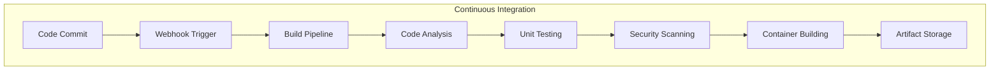

### Continuous Deployment
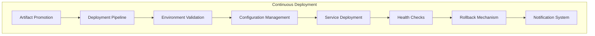

## Infrastructure as Code (IaC)

### Terraform Architecture
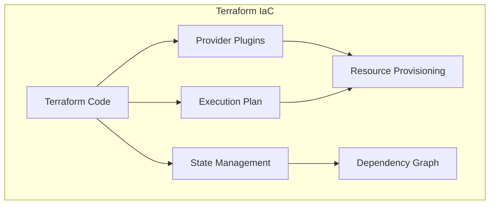

### Kubernetes Manifests
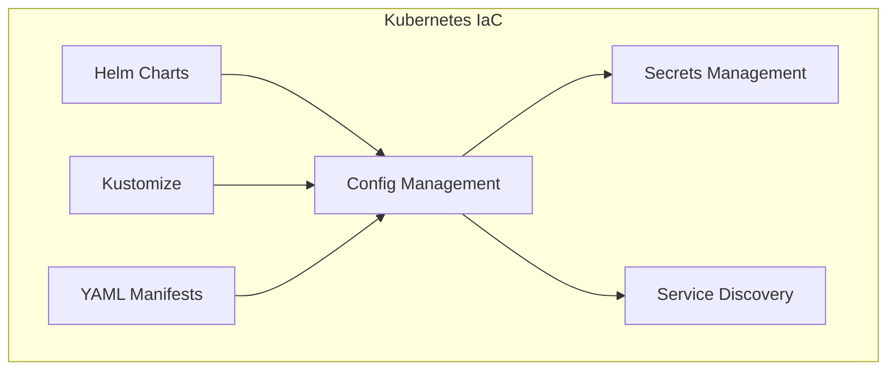

## Multi-Environment Strategy

### Environment Hierarchy
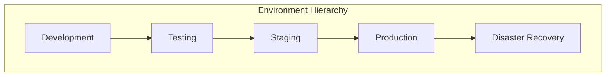

### Environment Isolation
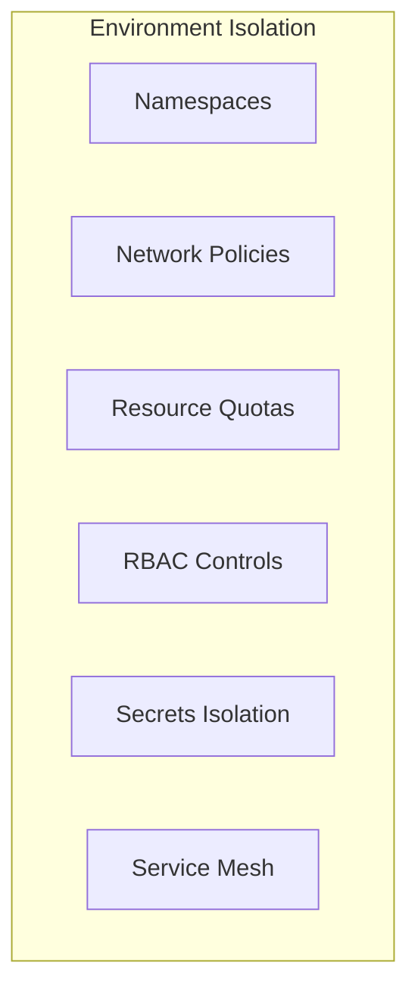

## Containerization Strategy

### Docker Architecture
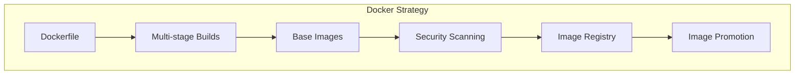

### Container Orchestration
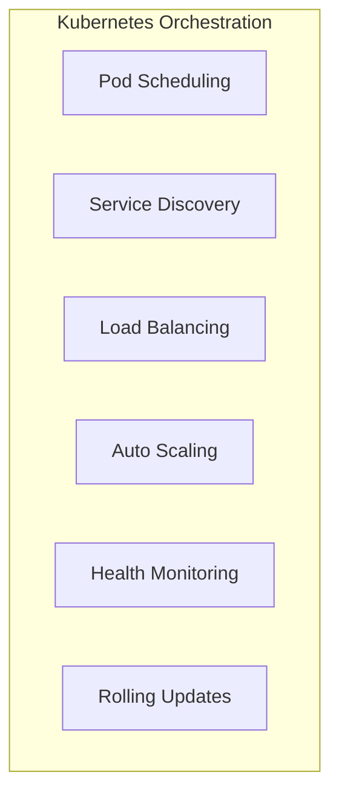

## Monitoring and Observability

### Monitoring Stack
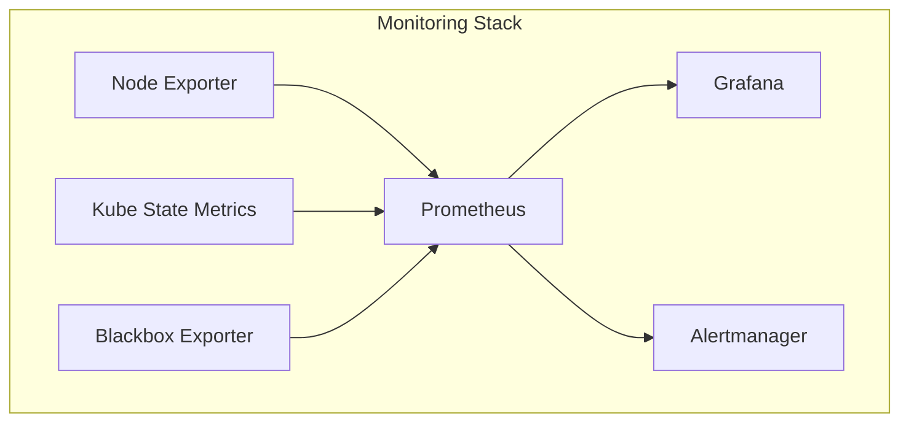

### Logging Architecture
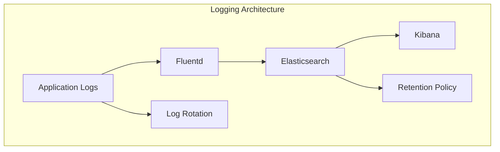

### Distributed Tracing
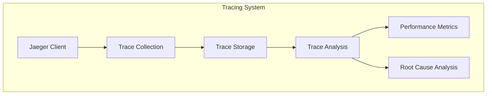

## Git Workflow and Repository Structure

### Branching Strategy
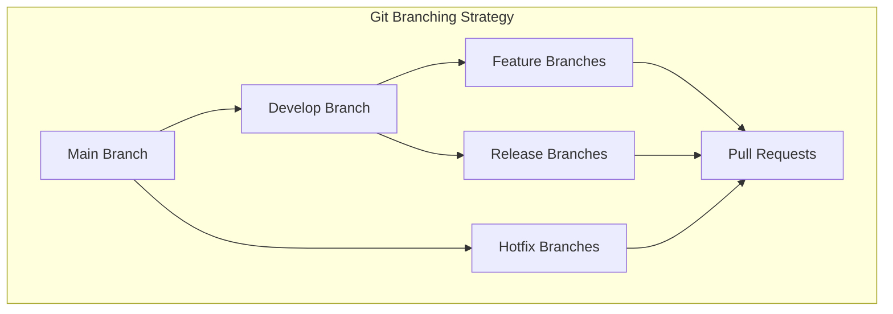

### Repository Organization
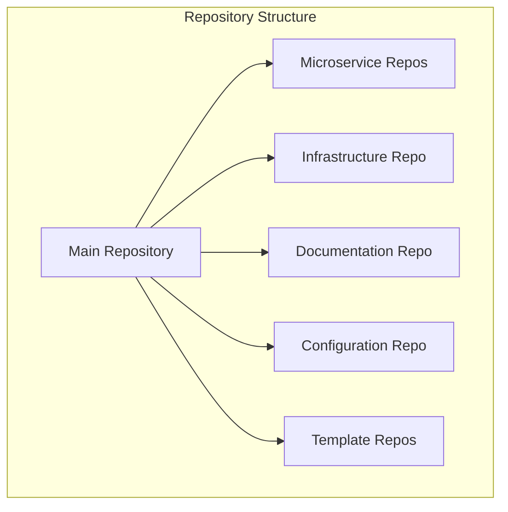

## Testing Strategy

### Test Pyramid
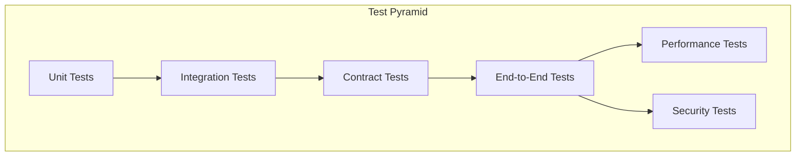

### Test Automation
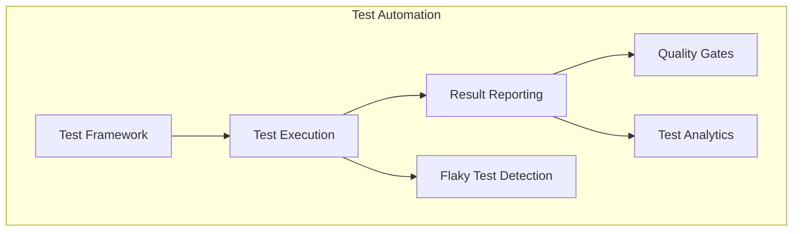

## Security in DevOps (DevSecOps)

### Security Integration
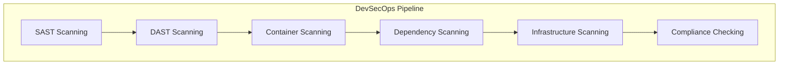

### Secret Management
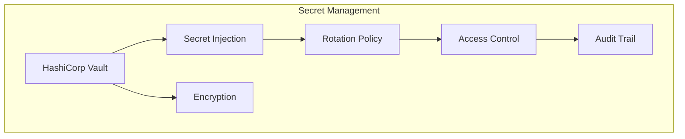

## Deployment Strategies

### Blue-Green Deployment
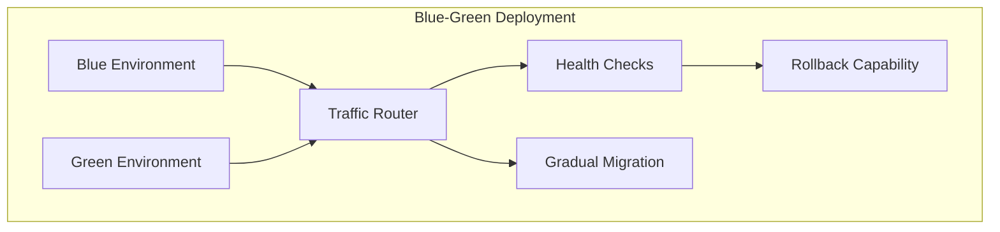

### Canary Deployment
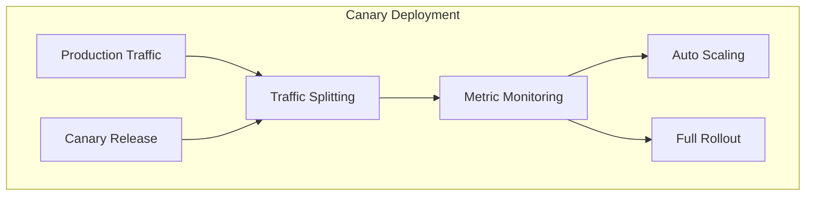

## Backup and Disaster Recovery

### Backup Strategy
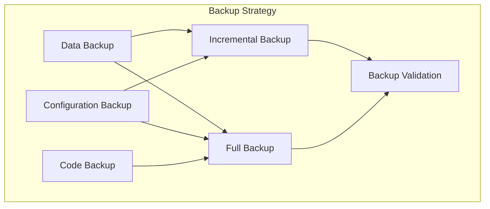

### Disaster Recovery
```mermaid
graph TB
    subgraph "Disaster Recovery"
        A[Primary Site]
        B[Secondary Site]
        C[Data Replication]
        D[Failover Process]
        E[Recovery Testing]
        F[Business Continuity]
    end

    A --> B
    B --> C
    C --> D
    D --> E
    E --> F
```

## Performance and Scalability

### Auto Scaling
```mermaid
graph TB
    subgraph "Auto Scaling"
        A[Metrics Collection]
        B[Scaling Policy]
        C[Resource Allocation]
        D[Load Distribution]
        E[Performance Monitoring]
        F[Cost Optimization]
    end

    A --> B
    B --> C
    C --> D
    D --> E
    E --> F
```

### Load Testing
```mermaid
graph TB
    subgraph "Load Testing"
        A[Test Scenarios]
        B[Load Generation]
        C[Performance Metrics]
        D[Bottleneck Analysis]
        E[Capacity Planning]
        F[Optimization]
    end

    A --> B
    B --> C
    C --> D
    D --> E
    E --> F
```

## Tools and Technologies

### CI/CD Tools
- **Jenkins**: Primary CI/CD server for pipeline orchestration
- **GitHub Actions**: For lightweight CI tasks and PR validation
- **ArgoCD**: GitOps continuous delivery for Kubernetes
- **Helm**: Package management for Kubernetes applications

### Infrastructure Tools
- **Terraform**: Infrastructure as Code for cloud resources
- **Kubernetes**: Container orchestration platform
- **Docker**: Containerization platform
- **Ansible**: Configuration management and automation

### Monitoring Tools
- **Prometheus**: Metrics collection and monitoring
- **Grafana**: Visualization and dashboarding
- **ELK Stack**: Log aggregation and analysis
- **Jaeger**: Distributed tracing

### Security Tools
- **SonarQube**: Static code analysis
- **OWASP ZAP**: Dynamic application security testing
- **Trivy**: Container and dependency scanning
- **Vault**: Secrets management

This DevOps architecture provides a comprehensive framework for building, testing, deploying, and monitoring the Supply Chain Finance Platform with automation, security, and scalability in mind.