# Microservices Architecture

## Overview

The Supply Chain Finance Platform follows a domain-driven microservices architecture where each service is responsible for a specific business domain. Services communicate through well-defined APIs and event-driven mechanisms.

## Service Domains and Responsibilities

### 1. User Management Service
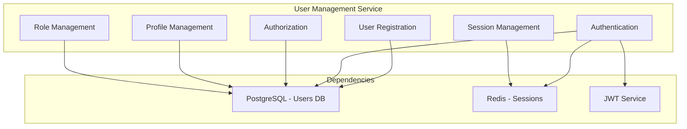

### 2. Supply Chain Service
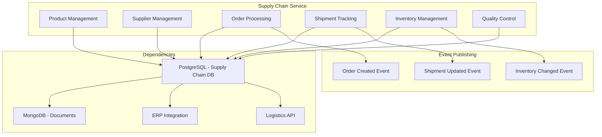

### 3. Finance Service
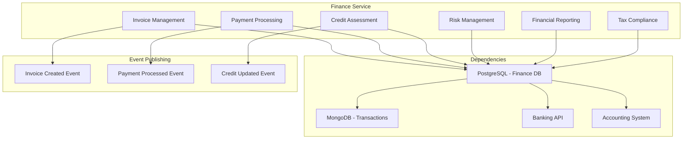

### 4. Analytics Service
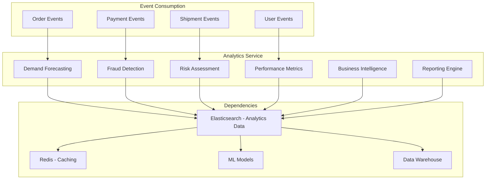

### 5. Blockchain Service
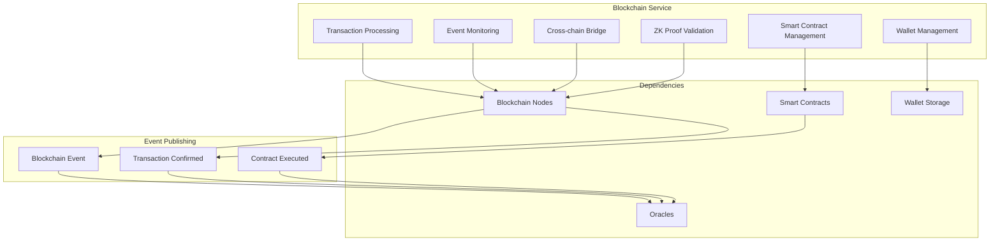

### 6. IoT Service
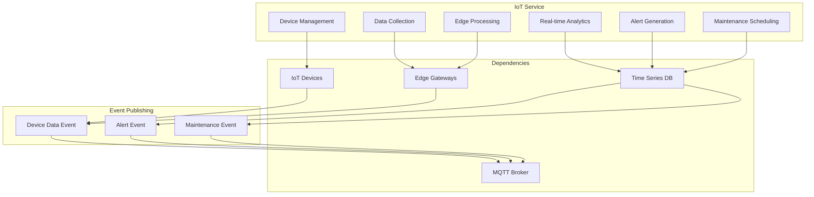

### 7. DeFi Service
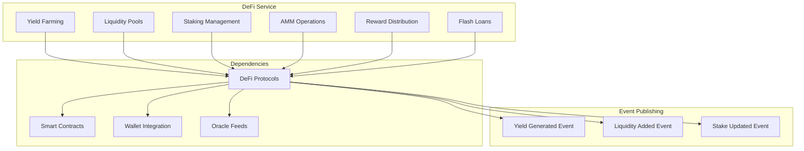

## Inter-Service Communication

### Synchronous Communication Flow
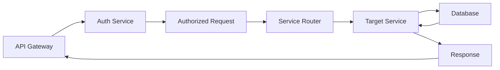

### Asynchronous Event Flow
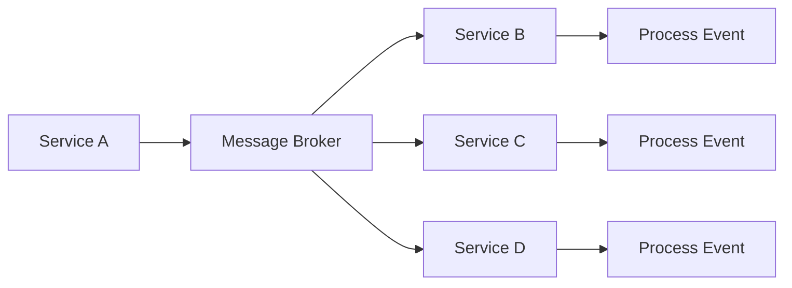

## Service Mesh Implementation
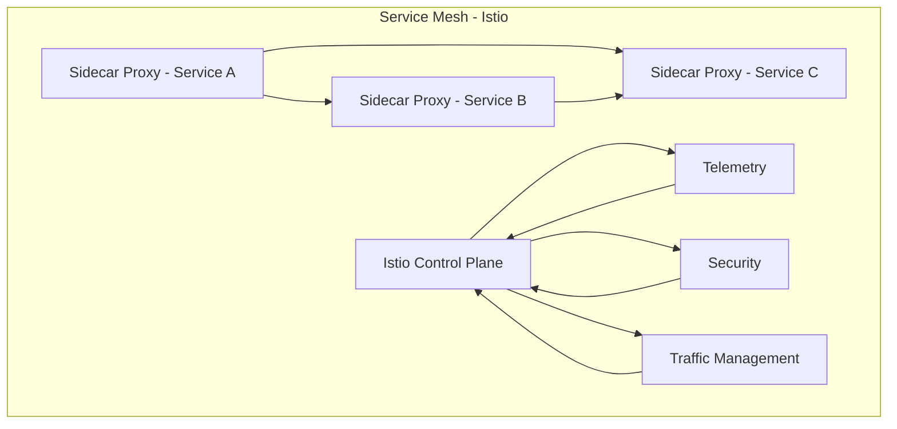

## Data Flow Patterns

### 1. Request-Response Pattern
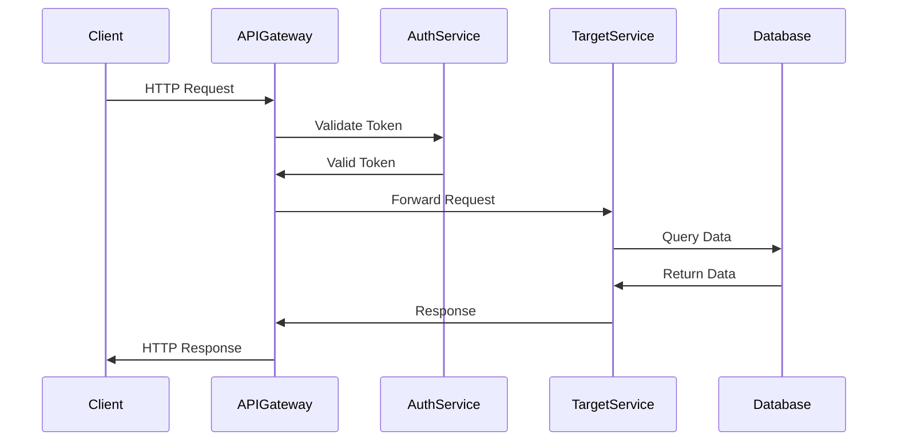

### 2. Event-Driven Pattern
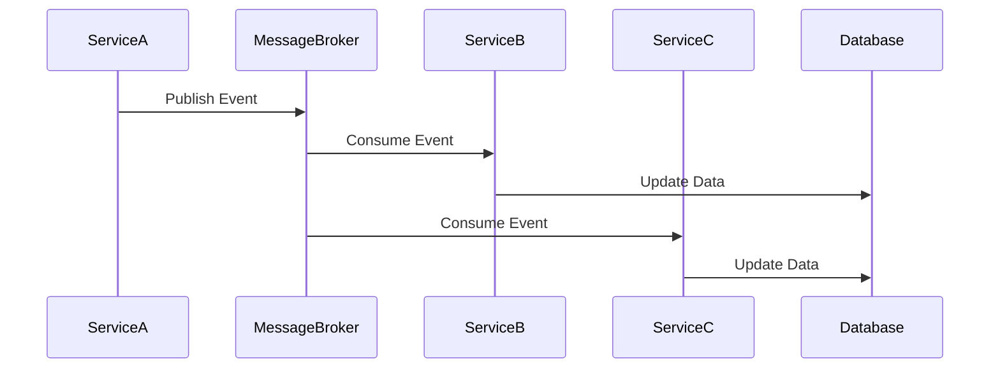

## Error Handling and Resilience

### Circuit Breaker Pattern
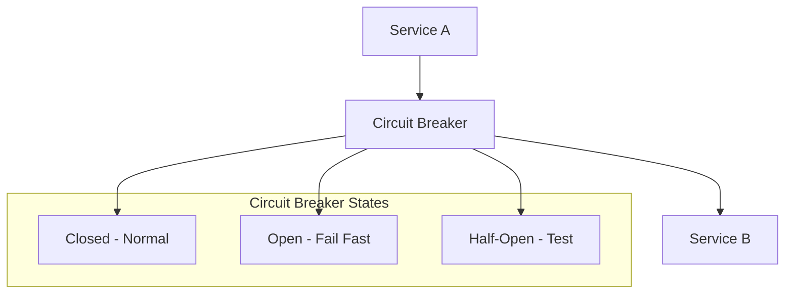

### Retry Pattern
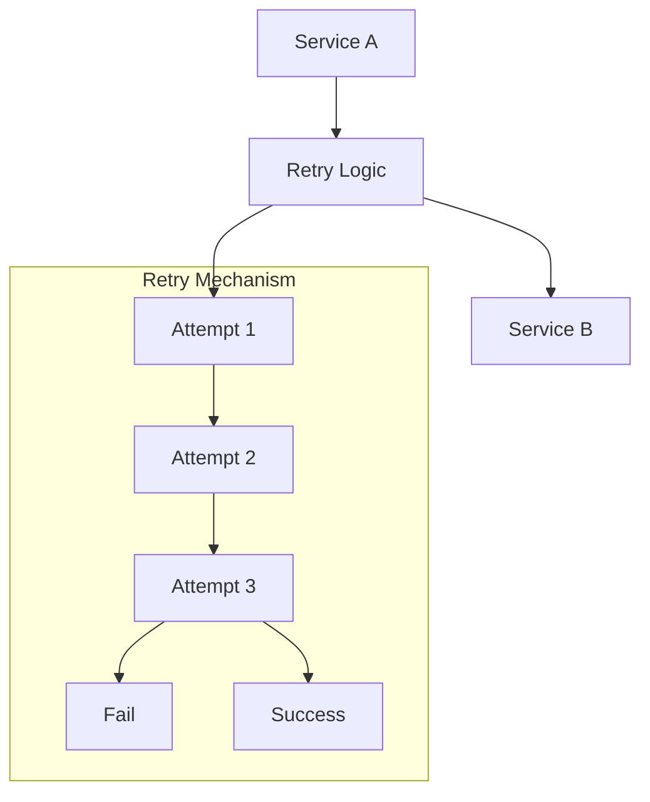

This microservices architecture diagram shows how different services in the platform are organized, their responsibilities, dependencies, and communication patterns. Each service is designed to be independently deployable and scalable.