# Security Architecture

## Overview

The Supply Chain Finance Platform implements a comprehensive security architecture based on zero-trust principles, defense in depth, and compliance with industry standards. This document describes the security controls, mechanisms, and best practices implemented across the platform.

## Security Principles

### Zero Trust Architecture
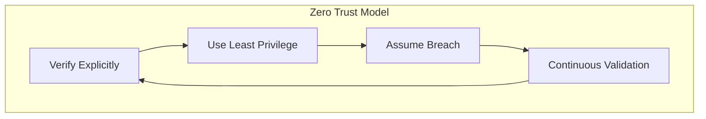

### Defense in Depth
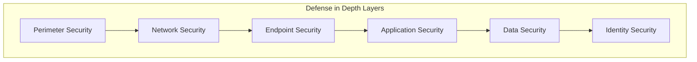

## Identity and Access Management

### Authentication Flow
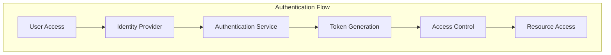

### Authorization Flow
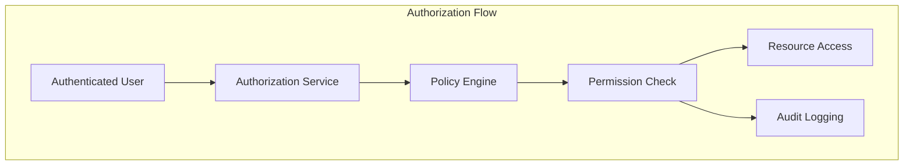

### Multi-Factor Authentication
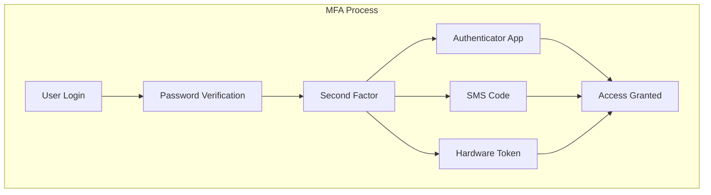

## Network Security

### Network Segmentation
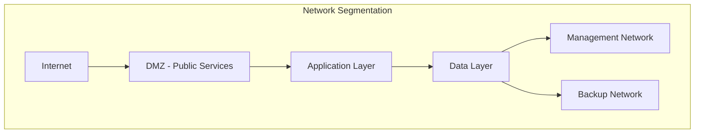

### Firewall Configuration
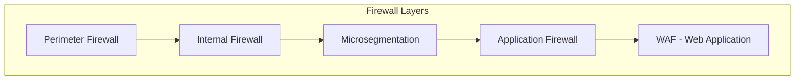

### Intrusion Detection and Prevention
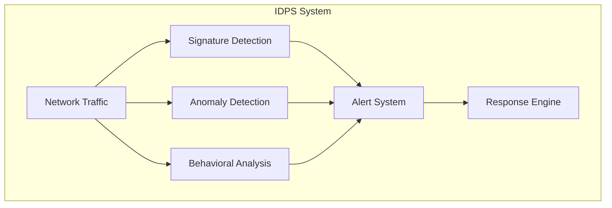

## Application Security

### Secure Coding Practices
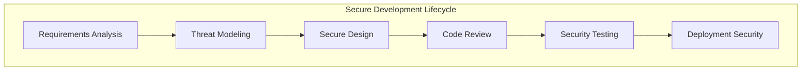

### API Security
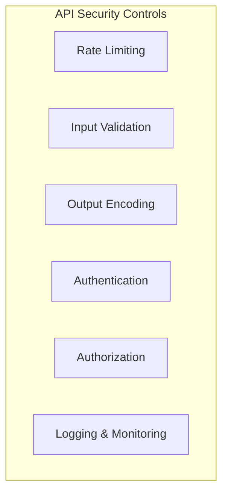

### Container Security
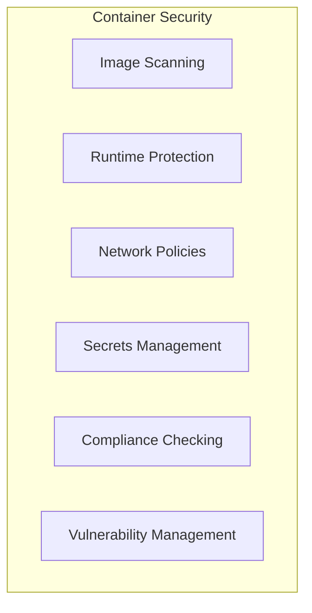

## Data Security

### Data Encryption
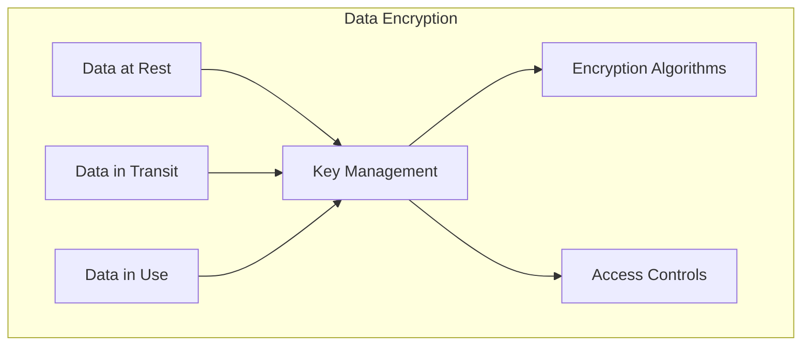

### Data Loss Prevention
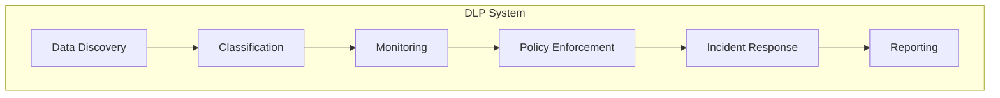

### Data Privacy Controls
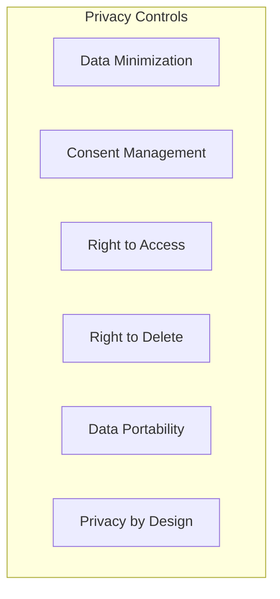

## Infrastructure Security

### Cloud Security
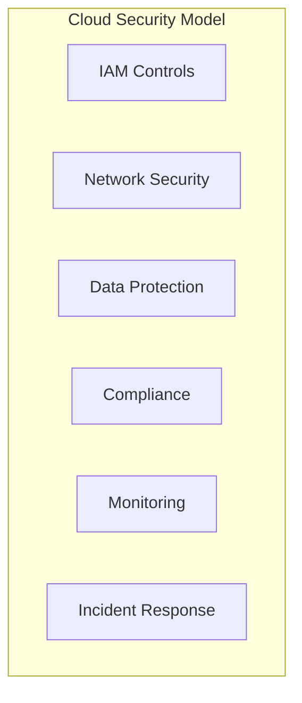

### Kubernetes Security
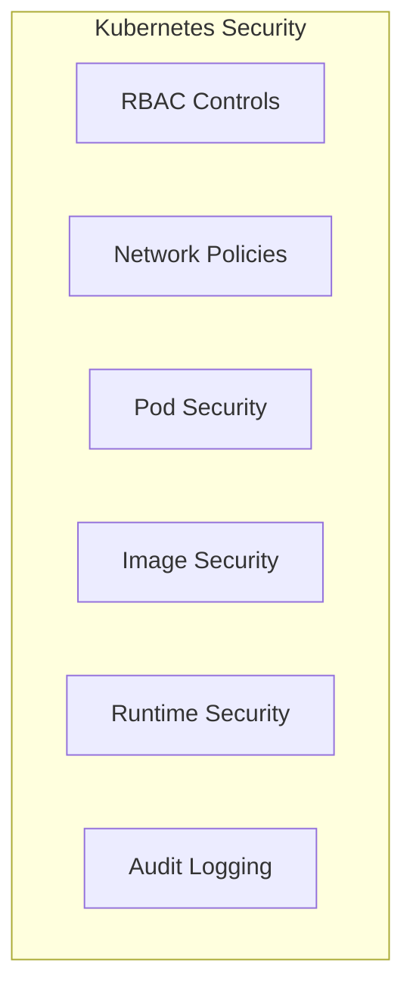

### Secrets Management
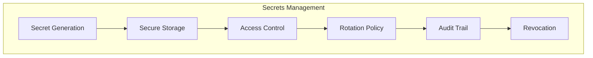

## Monitoring and Incident Response

### Security Information and Event Management (SIEM)
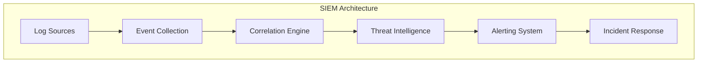

### Threat Detection
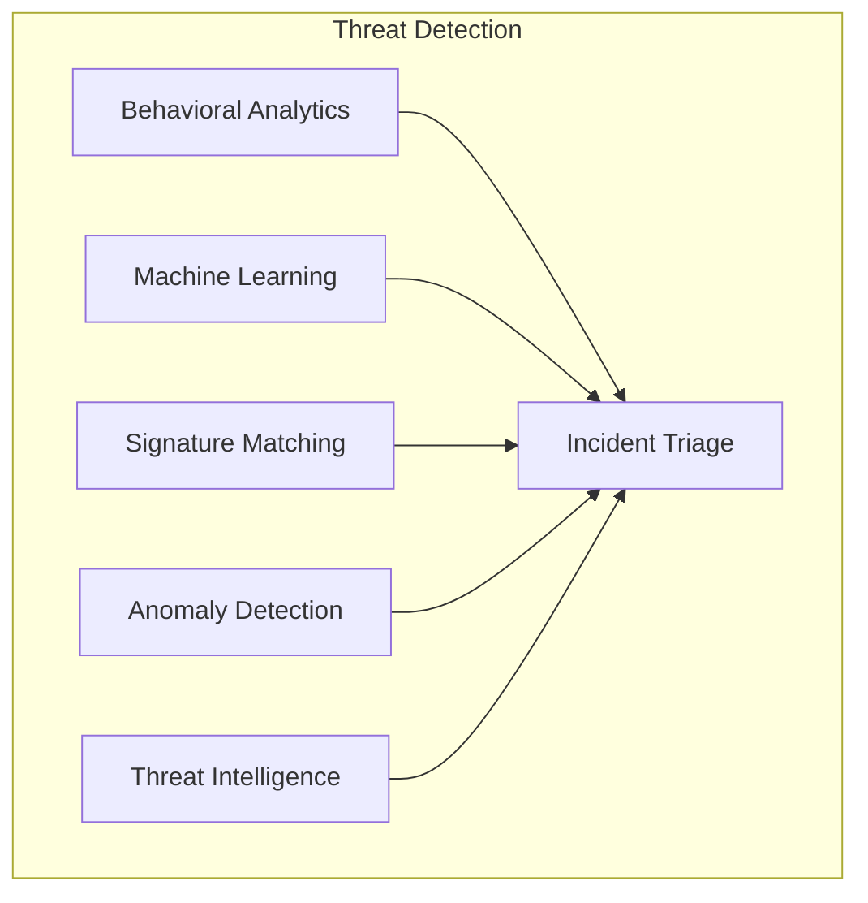

### Incident Response Process
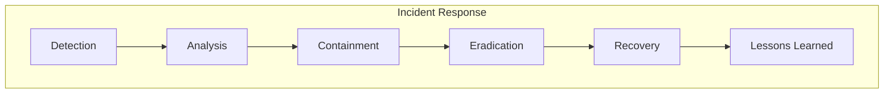

## Compliance and Governance

### Regulatory Compliance
```mermaid
graph TB
    subgraph "Compliance Framework"
        A[GDPR]
        B[SOX]
        C[PCI DSS]
        D[ISO 27001]
        E[NIST]
        F[Industry Standards]
    end
```

### Audit and Reporting
```mermaid
graph TB
    subgraph "Audit System"
        A[Continuous Monitoring]
        B[Compliance Checks]
        C[Vulnerability Scans]
        D[Penetration Testing]
        E[Security Audits]
        F[Reporting]
    end

    A --> F
    B --> F
    C --> F
    D --> F
    E --> F
```

### Risk Management
```mermaid
graph TB
    subgraph "Risk Management"
        A[Risk Assessment]
        B[Threat Modeling]
        C[Vulnerability Management]
        D[Risk Mitigation]
        E[Business Continuity]
        F[Disaster Recovery]
    end

    A --> D
    B --> D
    C --> D
    D --> E
    D --> F
```

## Security Controls Matrix

| Security Domain | Controls Implemented | Technology |
|----------------|---------------------|------------|
| Identity & Access | MFA, SSO, RBAC | Auth0, Okta |
| Network Security | Firewalls, IDS/IPS | Palo Alto, Snort |
| Application Security | WAF, Code Scanning | OWASP ZAP, SonarQube |
| Data Security | Encryption, DLP | AWS KMS, Varonis |
| Endpoint Security | EDR, Antivirus | CrowdStrike, SentinelOne |
| Cloud Security | CSPM, CIEM | Wiz, Palo Alto Prisma |
| Container Security | Image Scanning, Runtime Protection | Aqua Security, Sysdig |
| SIEM & Monitoring | Log Aggregation, Threat Detection | Splunk, ELK Stack |

## Security Metrics and KPIs

### Key Performance Indicators
```mermaid
graph TB
    subgraph "Security KPIs"
        A[MTTD - Mean Time to Detect]
        B[MTTR - Mean Time to Respond]
        C[Vulnerability Remediation Time]
        D[Security Incident Rate]
        E[Compliance Score]
        F[User Training Completion]
    end
```

This security architecture provides a comprehensive framework for protecting the Supply Chain Finance Platform across all layers of the system, from infrastructure to applications to data. The implementation follows industry best practices and regulatory requirements to ensure a robust security posture.