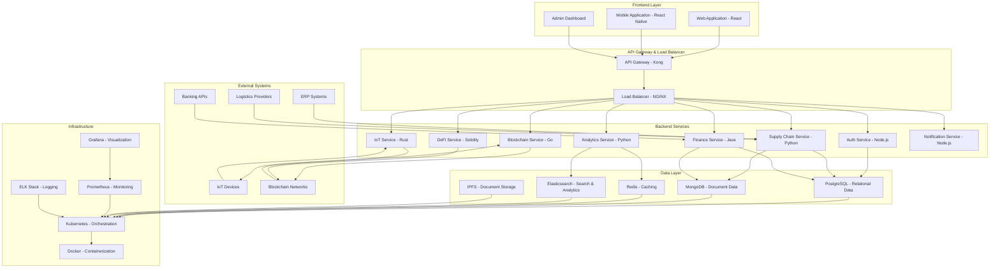
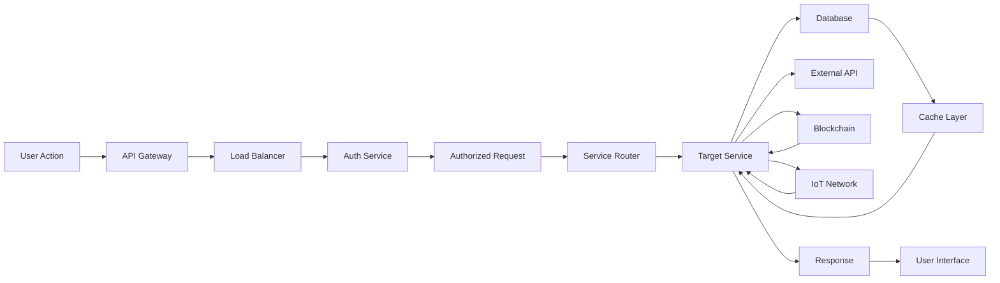
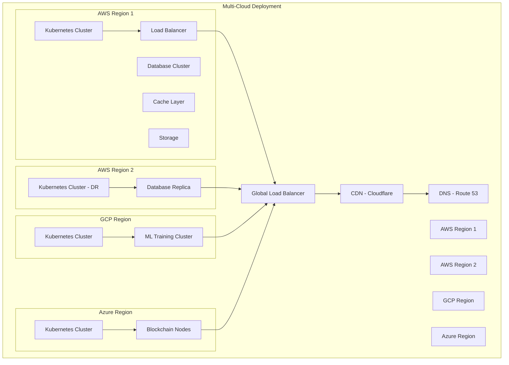
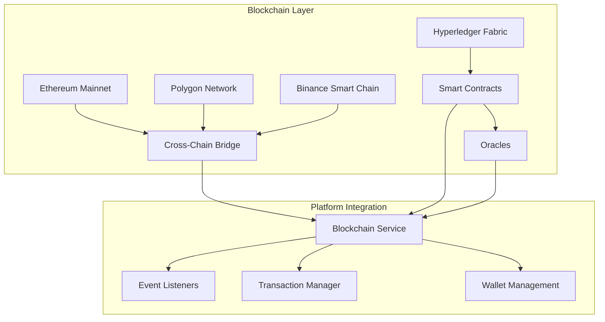
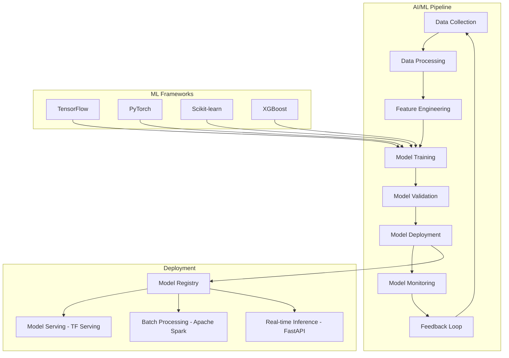
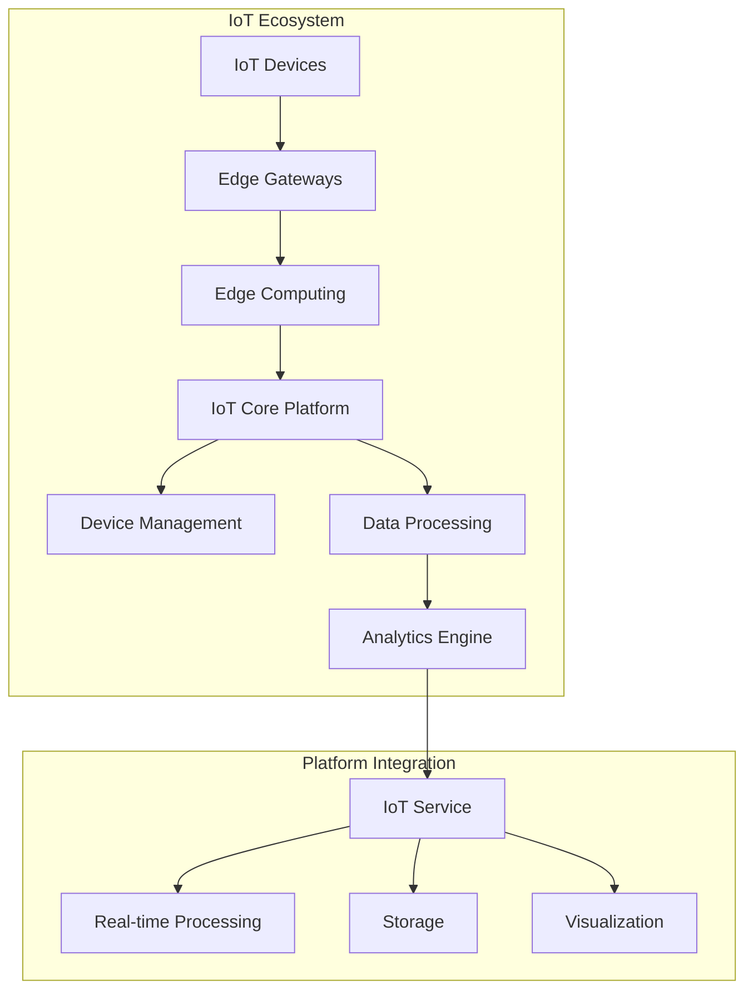
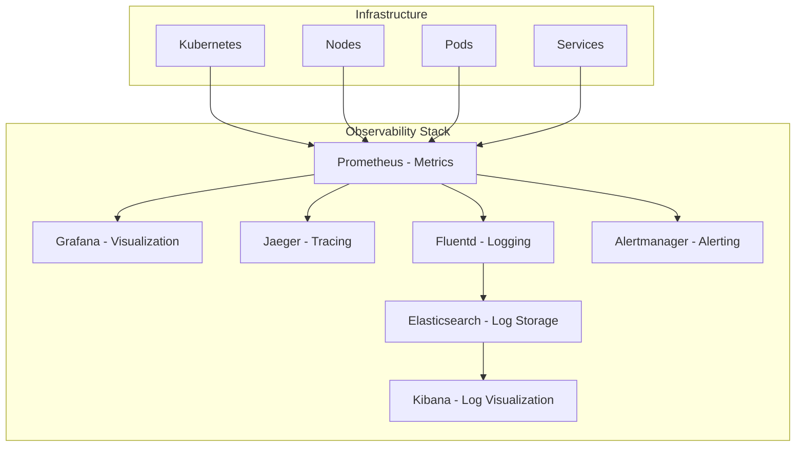

# System Architecture

## Overview

The Supply Chain Finance Platform is a comprehensive multi-domain system that integrates supply chain management, financial services, blockchain technology, AI/ML analytics, IoT data processing, and DeFi protocols. The platform follows a microservices architecture with clear domain boundaries and service separation.

## High-Level Architecture

## Service Layer Architecture

### 1. Authentication Service
- User registration and management
- JWT-based authentication
- Role-based access control
- Integration with external identity providers

### 2. Supply Chain Service
- Product and inventory management
- Supplier and buyer management
- Order processing
- Shipment tracking
- Integration with logistics providers

### 3. Finance Service
- Invoice management
- Payment processing
- Financial analytics
- Integration with banking systems

### 4. Analytics Service
- Demand forecasting using ML models
- Fraud detection
- Risk assessment
- Business intelligence dashboards

### 5. Blockchain Service
- Smart contract execution
- Invoice and shipment verification
- Cross-chain bridge operations
- Zero-knowledge proof validation

### 6. IoT Service
- Device management
- Real-time data processing
- Edge computing capabilities
- Sensor data analytics

### 7. DeFi Service
- Yield farming protocols
- Liquidity pool management
- Staking mechanisms
- Automated market makers

### 8. Notification Service
- Email notifications
- SMS alerts
- Push notifications
- In-app messaging

## Data Flow Architecture

## Security Architecture

```mermaid
graph TB
    subgraph "Zero Trust Security Model"
        A[Identity Provider]
        B[Authentication Service]
        C[Authorization Engine]
        D[API Gateway - Security Layer]
        E[Service Mesh - Istio]
        F[Network Policies - Cilium]
        G[Secrets Management - HashiCorp Vault]
        H[Encryption - AES-256]
        I[Key Management - AWS KMS]
        J[Security Monitoring - SIEM]
        K[Intrusion Detection - Snort]
        L[Vulnerability Scanning - OWASP ZAP]
    end

    A --> B
    B --> C
    C --> D
    D --> E
    E --> F
    F --> G
    G --> H
    H --> I
    I --> J
    J --> K
    K --> L
```

## Deployment Architecture

## Microservices Communication Patterns

### 1. Synchronous Communication
- RESTful APIs for direct service-to-service communication
- GraphQL for complex data queries
- gRPC for high-performance internal communication

### 2. Asynchronous Communication
- Apache Kafka for event streaming
- RabbitMQ for message queuing
- Redis Pub/Sub for real-time notifications

### 3. Service Mesh
- Istio for traffic management
- Mutual TLS for service-to-service encryption
- Observability through distributed tracing

## Data Architecture

### 1. Relational Data (PostgreSQL)
- User accounts and profiles
- Financial transactions
- Invoice records
- Order management

### 2. Document Data (MongoDB)
- Product catalogs
- Analytics data
- Configuration settings
- Audit logs

### 3. Caching Layer (Redis)
- Session data
- Frequently accessed records
- Real-time analytics counters

### 4. Search & Analytics (Elasticsearch)
- Log aggregation
- Business intelligence queries
- Full-text search capabilities

### 5. Distributed Storage (IPFS)
- Contract documents
- Shipping manifests
- Compliance records
- Audit trails

## Blockchain Integration Architecture

## AI/ML Architecture

## IoT Architecture

## Monitoring & Observability

This architecture diagram provides a comprehensive view of the Supply Chain Finance Platform, showing how different components interact and how the system is organized across multiple domains and technologies.